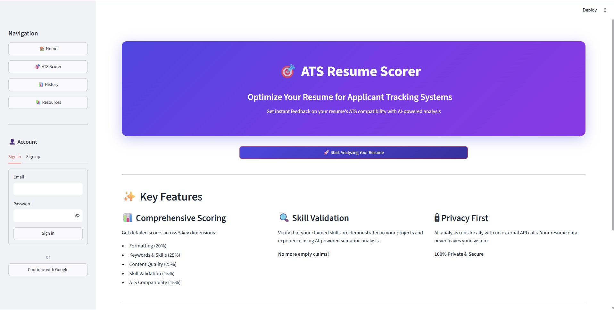
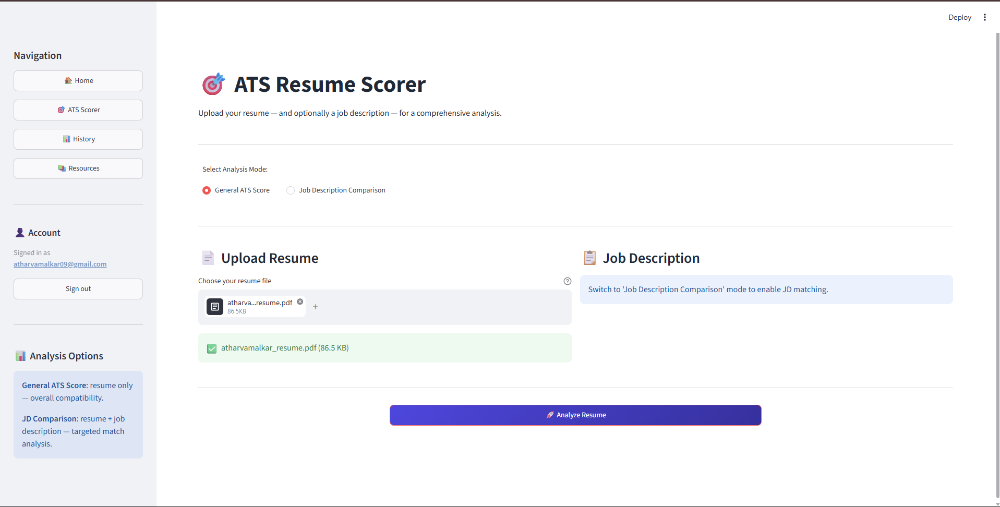
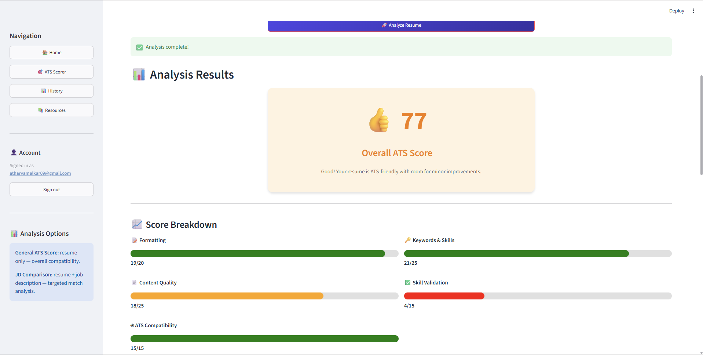

# ATS-Resume-Scorer

ATS Resume Scorer is a full-stack Python application for analyzing and scoring resumes against job descriptions. It leverages NLP and AI to simulate modern Applicant Tracking Systems (ATS). Because ATS are ubiquitous – used by 98% of Fortune 500 companies and ~75% of organizations overall – optimizing resumes for these systems is crucial. This project provides features like keyword and skill matching, formatting checks, and score explanations, plus PDF reports with improvement suggestions. 

It uses a FastAPI backend (for API endpoints and scoring logic) and a Streamlit frontend (for a user-friendly UI), with Supabase handling authentication and data storage. The ATS scoring pipeline extracts text from resumes, identifies relevant keywords/skills (using spaCy), computes semantic similarity (via SentenceTransformers), checks formatting, and combines these into a custom score. The report also uses a Groq LLM to generate targeted resume improvement tips, with careful prompt design and moderation.

This README covers the project’s value proposition, features, architecture, installation, usage, API, scoring logic, testing, deployment, and contributor guidelines in detail.

Project Overview
ATS Resume Scorer analyses jobseekers’ resumes to determine how well they match a given job description, simulating the behavior of Applicant Tracking Systems. ATS use automated filters that assess resumes based on keyword relevance, structure, and formatting. Our tool provides an ATS Compatibility Score by combining multiple factors: keyword/skill matching between resume and job description, semantic similarity of content (using embeddings), and formatting checks (to ensure ATS-friendly layout). It also performs format/structure analysis (no images or complex layouts) and core section checks (experience, education, skills) akin to commercial ATS. The system gives actionable feedback: it highlights missing keywords, suggests content improvements via an LLM, and generates a professional PDF report. Supabase handles secure user authentication, resume history storage, and a PostgreSQL database. This project streamlines resume optimization for job applications, leveraging modern ML/NLP techniques and best practices.

UI Snapshots

Resume Submission Page: User uploads a PDF or text resume and pastes the job description.

Score & Feedback: Displays an ATS match score, matched skills, missing keywords, and an overall analysis.

Suggestions: Shows AI-generated tips to improve the resume (e.g. "Add your SQL experience" or "Use simpler formatting").
Report Generation: A button to download a styled PDF report of the analysis.

History Dashboard: (For authenticated users) List of past analyses with links to PDF results.

Features
Resume Parsing: Upload resumes (PDF, DOCX, or text); extract and preprocess text (strip formatting).

Skill & Keyword Extraction: Identify key skills/technologies using spaCy NER and a custom skill list, linking to target JD.

Semantic Matching: Use SentenceTransformers embeddings (e.g. all-MiniLM-L6-v2 for speed) to compute semantic similarity between resume content and job description.

Keyword Overlap Scoring: Count overlapping keywords between resume and JD; highlight missing important terms.

Formatting & Structure Check: Verify ATS-friendly layout (no images, no tables, standard headings).

ATS Score Calculation: Combine semantic similarity, keyword score, and formatting factors into a unified ATS score (customizable).

AI Suggestions: Use a large language model (Groq LLM) to generate personalized improvement advice (with controlled prompts and temperature for safety).

PDF Report: Create a well-formatted PDF report (via Jinja2 templates + WeasyPrint), summarizing results and tips.

User Auth & History: Secure login/signup via Supabase Auth, with a database of past resume analyses.

API & UI: FastAPI serves a JSON-based API; Streamlit provides the frontend UI. A RESTful JSON API is fully documented.

Deployment Options: Supports Docker/Docker Compose, and can be deployed on Heroku, Vercel (for frontend), AWS/GCP, or Kubernetes.

Security & Privacy: Follows best practices (HTTPS, env secrets, minimal data retention). Users’ resumes are handled securely; personal data retention follows GDPR principles (keep only as needed).

Architecture & Components
The system follows a separation of concerns: a Streamlit frontend for user interaction, and a FastAPI backend for processing. The backend orchestrates the ATS scoring pipeline, interfaces with Supabase (for auth and DB) and external services (LLM API, WeasyPrint). The following Mermaid diagram illustrates the high-level architecture:

Streamlit UI (Frontend): Handles user authentication and input (resume, job description). Displays scores, charts, and AI suggestions. Communicates with backend via REST calls.

FastAPI Backend: Core API server. Receives requests, validates via Supabase Auth, and runs the scoring pipeline. Exposes JSON endpoints (with auth) for actions like /score_resume, /get_history, /generate_report.

Supabase (Auth & DB): Provides user management (sign-up, login, JWT tokens) and PostgreSQL for storing resumes, job descriptions, analysis results, and user history.

spaCy (NLP): Parses and analyzes resume text (tokenization, named entity recognition for skills, etc.). SpaCy is an industrial-strength NLP library in Python, offering pre-trained pipelines with tokenization, NER, word vectors and more.

SentenceTransformers (Embeddings): Converts text (resume sections and job description) into vector embeddings to compute semantic similarity scores. We use a model like all-MiniLM-L6-v2 which is 5× faster with good quality.

ATS Scoring Module: Implements the core logic (keyword matching, similarity calculation, formatting checks, final score formula). E.g., it checks for required sections and ATS-friendly formatting and sums weighted subscores.

Groq LLM API: A large language model (Llama 3 via Groq’s API) generates tailored feedback. Prompts are carefully crafted and sanitized to avoid hallucination or sensitive issues.

Jinja2 + WeasyPrint (Report Generation): Uses Jinja2 templates to render HTML summaries, then WeasyPrint converts them to PDF. WeasyPrint is an open-source library that “turns simple HTML pages into... PDF documents”, ideal for reports.

## 🛠️ Tech Stack

Backend            : FastAPI
Frontend           : Streamlit
Database           : PostgreSQL (Supabase)
Authentication     : Supabase Auth
NLP                : spaCy
AI/LLM             : Sentence Transformers, Groq (Llama 3)
PDF Generation     : Jinja2, WeasyPrint
Version Control    : Git, GitHub
